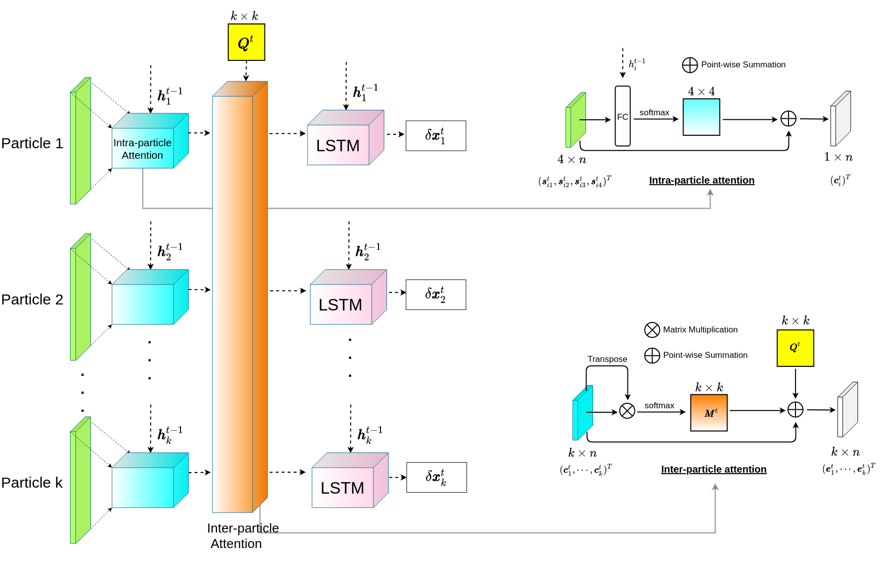

# Welcome to LOIS's doumentation!

## Overview
This is the documentation for **LOIS**: Learning to Optimize in Swarms. 

**LOIS** is a 'Learning to Optimize' framework with swarm intelligence and posterior estimation to automatically design optimizers for various objective functions.

If you find this documention is useful, please cite our [paper](https://proceedings.neurips.cc/paper/2019/file/ec04e8ebba7e132043e5b4832e54f070-Paper.pdf).

## Content

* [Overview](index.md)
* [Motivation](motivation.md)
* [Installation](install.md)
* [Add your function](user_docs/func.md)
* [Training](user_docs/train.md)
* [Evaluation](user_docs/eval.md)

